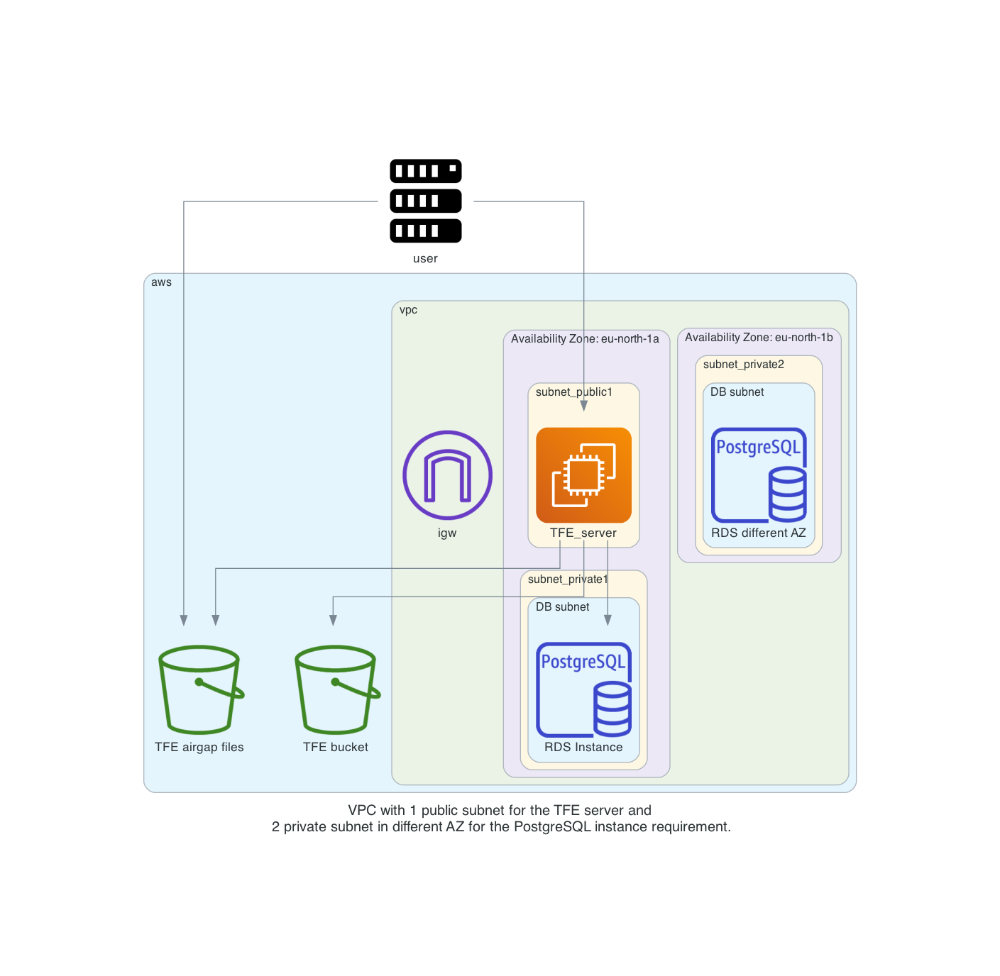

# Terraform Enterprise online installation with External Services (S3 + PostgreSQL) an valid certificates

With this repository you will be able to do a TFE (Terraform Enterprise) online installation on AWS with external services for storage in the form of S3 and PostgreSQL and a valid certificate. 

The Terraform code will do the following steps

- Create S3 buckets used for TFE
- Upload the necessary software/files for the TFE installation to an S3 bucket
- Generate TLS certificates with Let's Encrypt to be used by TFE
- Create a VPC network with subnets, security groups, internet gateway
- Create a RDS PostgreSQL to be used by TFE
- create roles/profiles for the TFE instance to access S3 buckets
- Create a EC2 instance on which the TFE online installation will be performed

# Diagram

  

# Prerequisites

## License
Make sure you have a TFE license available for use

Store this under the directory `files/license.rli`

## AWS
We will be using AWS. Make sure you have the following
- AWS account  
- Install AWS cli [See documentation](https://docs.aws.amazon.com/cli/latest/userguide/install-cliv2.html)

## Install terraform  
See the following documentation [How to install Terraform](https://learn.hashicorp.com/tutorials/terraform/install-cli)

## TLS certificate
You need to have valid TLS certificates that can be used with the DNS name you will be using to contact the TFE instance.  
  
The repo assumes you have no certificates and want to create them using Let's Encrypt and that your DNS domain is managed under AWS. 

# How to

- Clone the repository to your local machine
```
git clone https://github.com/munnep/TFE_aws_external.git
```
- Go to the directory
```
cd TFE_aws_external
```
- Set your AWS credentials
```
export AWS_ACCESS_KEY_ID=
export AWS_SECRET_ACCESS_KEY=
export AWS_SESSION_TOKEN=
```
- Store the files needed for the TFE online installation under the `./files` directory, See the notes [here](./files/README.md)
- create a file called `variables.auto.tfvars` with the following contents and your own values
```
tag_prefix               = "patrick-tfe"
region                   = "eu-north-1"
vpc_cidr                 = "10.234.0.0/16"
ami                      = "ami-09f0506c9ef0fb473"
rds_password             = "Password#1"
filename_license         = "license.rli"
dns_hostname             = "patrick-tfe3"
dns_zonename             = "bg.hashicorp-success.com"
tfe_password             = "Password#1"
certificate_email        = "patrick.munne@hashicorp.com"
public_key               = "ssh-rsa AAAAB3NzaC1yc2EAAAADAQABAAABAQCX6Lfd55bPSMPJJvHoF4+3iGNLuJ1gz3Ov9uVnsWFCy6rcFk8IDhjFGRoTylXyJVns6CpFxonKZ2tcKFkSK3601sztrbJNzlgpJg/WoX7wbTy3SgLVhK8xpYBCh/LfX6UvofVBO1OVo2lkv2mFNgn5S3q9dKqUc32bRvWaoPqeuSUghvDsB9SxMr1Ih5Qg3IWYk587dCkVMrL3KMiN361qEkGcfu3kkpcQnpAO00alXJ2WksvQbut3w1vP2/osuoavA6Z22WjzicPIqwV1yQfNjdxj+XjZ1Re3TQ4kwA1h5AAsYko4LyIUjP1ZiBTTej9k2Yodl+VO2a1AypPrLcdN"
```
- Terraform initialize
```
terraform init
```
- Terraform plan
```
terraform plan
```
- Terraform apply
```
terraform apply
```
- Terraform output should create 33 resources and show you the public dns string you can use to connect to the TFE instance
```
Apply complete! Resources: 33 added, 0 changed, 0 destroyed.

Outputs:

ssh_tfe_server = "ssh ubuntu@patrick-tfe3.bg.hashicorp-success.com"
ssh_tfe_server_ip = "ssh ubuntu@13.51.23.34"
tfe_appplication = "https://patrick-tfe3.bg.hashicorp-success.com"
tfe_dashboard = "https://patrick-tfe3.bg.hashicorp-success.com:8800"
```
- Connect to the TFE dashboard. This could take 10 minutes before fully functioning
   
- Click on the open button to create your organization and workspaces

# TODO
- [ ] install TFE

# DONE
- [x] Create an AWS RDS PostgreSQL
- [x] create a virtual machine in a public network with public IP address.
    - [x] use standard ubuntu 
    - [x] firewall inbound are all from user building external ip
    - [x] firewall outbound rules
          postgresql rds
          AWS bucket          
- [x] Create an AWS bucket
- [x] create an elastic IP to attach to the instance
- [x] transfer files to TFE virtual machine
      - license
      - TLS certificates
- [x] Create a valid certificate to use 
- [x] point dns name to public ip address
- [x] build network according to the diagram
- [x] test it manually


